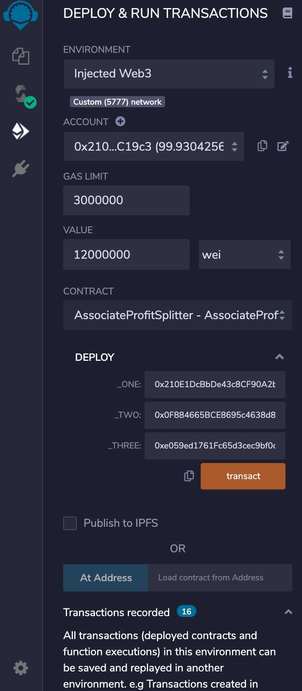
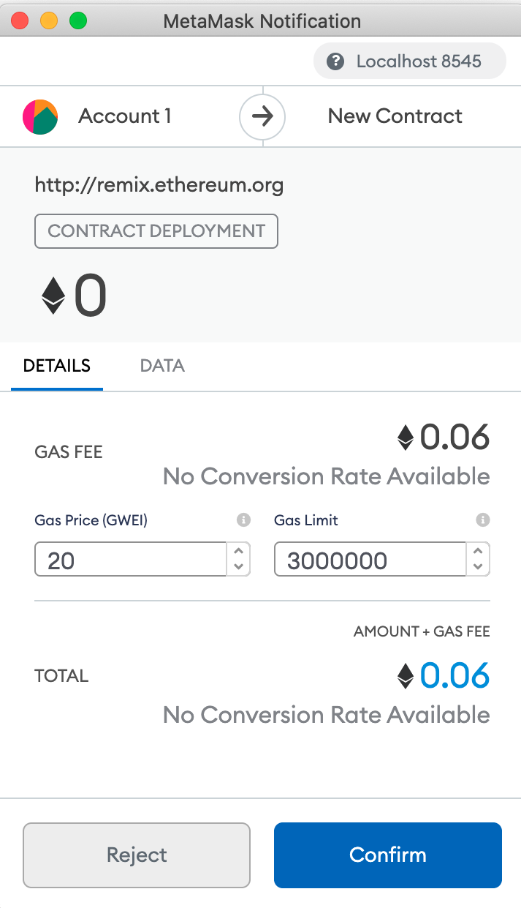

# smart_contracts
Below is a screenshot of the contract configuration for the level one assignment. After compilation, we switch the enviroment to Injected Web3 so that Metamask and Ganache are connected to the contract. Select the account, value and the paste the first three addresses in the ganache workspace under Deploy. Click "transact" and you should have the transaction recorded. 

The picture below illustrates that metamask is in sync with the Localhost 8545 which is the network connected to Ganache.

